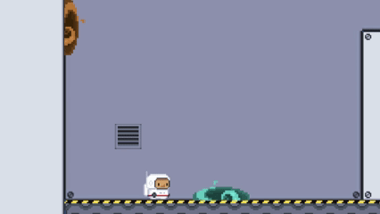
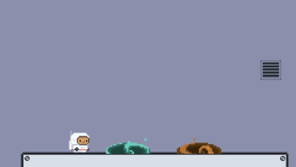

# Portal2DMechanicDemo
C# implementation of momentum-preserving portals in Unity 2D. Focused on momentum conservation and physics-based teleportation.

<p align="center">
  
  
</p>

## Key Features

### 1. Dynamic Portal Generation (`PortalProjectile.cs`)
* **Surface Normal Alignment:** Projectiles calculate the impact surface's normal to instantiate portals with the correct rotation using `Mathf.Atan2`.
* **Placement Validation:** Includes a safety check to prevent portal overlapping or "blocked impacts" based on distance.
* **Dynamic Parent-Child Relationship:** Portals automatically become children of "Platforms," allowing for moving portal mechanics.

### 2. Physics-Based Teleportation (`PortalBehaviour.cs`)
* **Velocity Preservation:** The system captures the player's entry speed and redirects it according to the output portal's orientation.
* **Dynamic Exit Velocity:** Includes a 'Minimum Exit Velocity' setting to ensure the player never gets stuck when entering a portal at low speeds.
* **Safety Margin:** Implements a calculated offset in the exit direction to prevent the player from getting stuck inside geometry.

### 3. Weapon System (`PortalGun.cs`)
* **Mouse-Look Integration:** The weapon rotates dynamically toward the cursor with sprite-flipping logic to ensure visual consistency.
* **State-Based Input:** Uses the **Unity Input System** to handle equipping and firing different portal types (A and B).
* **Animation & Audio Sync:** Integrated triggers for shooting animations and sound effects upon firing.


## Architecture & Modularity
This system was designed to allow each component to function independently:

* **Decoupled Logic:** The `PortalBehaviour` script is completely independent of the weapon system, allowing teleportation for any object with a `Rigidbody2D` (players, enemies, or physics props).
* **State-Driven Input:** Leveraging the **New Unity Input System**, the `PortalGun` manages weapon states (equipped/de-equipped) without interfering with the player's core movement logic.
* **Procedural Placement:** The `PortalProjectile` uses contact normals to calculate orientation on the fly, making it compatible with any 2D environment geometry.

## How to use
1. **Setup Portals:** Create two portal prefabs and attach the `PortalBehaviour.cs` script. Link them via Tags.
2. **Configure the Gun:** Attach `PortalGun.cs` to your character/gun and assign the portal projectiles and shoot points in the Inspector.
3. **Collision Layers:** Ensure your environment has the "Platforms" tag (or your custom tag) for the projectiles to parent correctly upon impact.
4. **Inputs:** Use the defined Input Actions to equip the gun and fire Portal A or Portal B.


The core logic handles the physics transition by capturing the `Rigidbody2D` velocity magnitude and re-applying it to the target portal's exit vector:

```csharp
private void Teleport(GameObject obj, Transform exitTransform)
{
    Rigidbody2D rb = obj.GetComponent<Rigidbody2D>();

    if (rb != null)
    {
        float magnitude = rb.velocity.magnitude;
        if (magnitude < minExitVelocity)
        {
            magnitude = minExitVelocity;
        }
        obj.transform.position = exitTransform.position + exitTransform.right * 0.7f; 
        rb.velocity = exitTransform.right * magnitude;
    }
}

---
*Developed by a Otero
